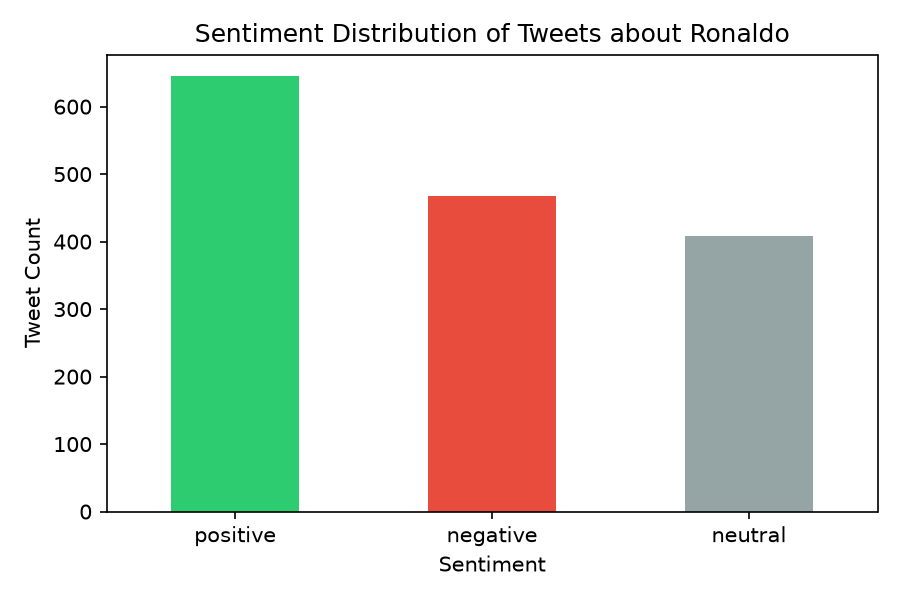
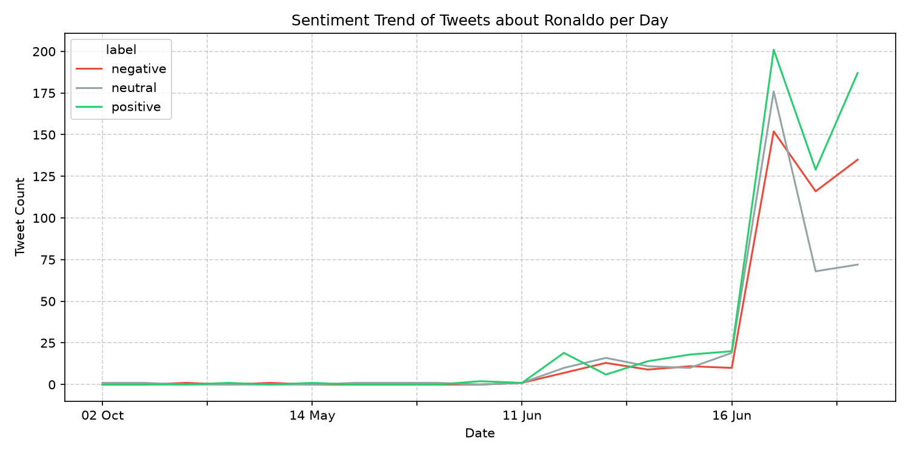
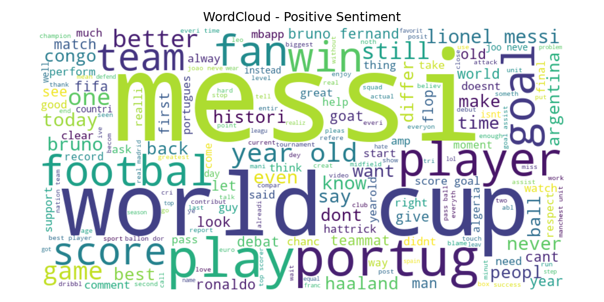
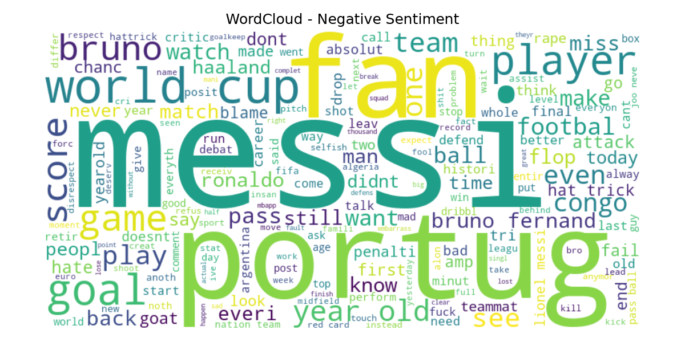
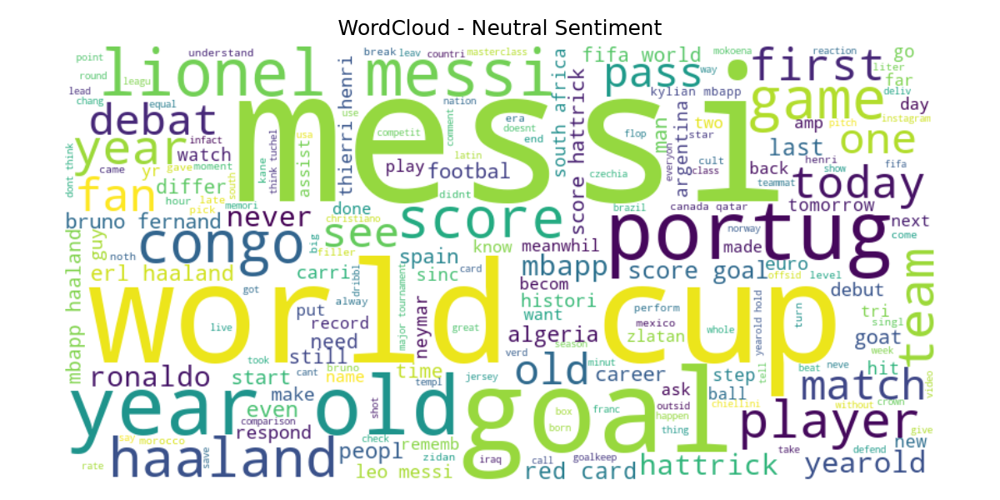
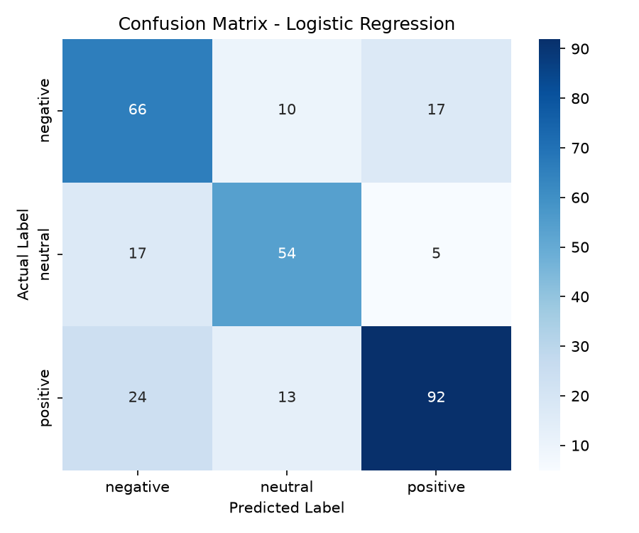

# Cristiano Ronaldo Twitter Sentiment Analysis 2026

What the World Thinks of Ronaldo in 2026: An End-to-End Twitter Sentiment Analysis and Machine Learning Classification Study during the FIFA World Cup / Euro Season.

---

## Table of Contents
1. [Project Goals & Overview](#1-project-goals--overview)
2. [Project Structure](#2-project-structure)
3. [Environment Setup & Installation](#3-environment-setup--installation)
4. [Scraper Setup & Twitter Authentication (`twifork`)](#4-scraper-setup--twitter-authentication-twifork)
5. [Data Pipeline Execution Guide](#5-data-pipeline-execution-guide)
6. [Exploratory Data Analysis (EDA) & Visualizations](#6-exploratory-data-analysis-eda--visualizations)
7. [Text Preprocessing & Feature Engineering](#7-text-preprocessing--feature-engineering)
8. [Machine Learning Modeling & Evaluation](#8-machine-learning-modeling--evaluation)
9. [Interactive Streamlit Dashboard](#9-interactive-streamlit-dashboard)
10. [Key Takeaways & Conclusion](#10-key-takeaways--conclusion)

---

## 1. Project Goals & Overview

The primary goal of this project is to answer the question:
> **"How is the public sentiment on Twitter (X) towards Cristiano Ronaldo, and is the majority negative compared to other players like Messi, Haaland, and Mbappe?"**

This study implements an end-to-end sentiment analysis and machine learning pipeline to collect tweets, clean their textual content, label sentiments using VADER, train classification models, and visualize results on an interactive dashboard.

### Expected Outputs
* **Clean Dataset:** Labeled sentiment tweets, cleaned and ready for machine learning model training.
* **Trained Classifier:** Saved classification model and feature extraction vectorizer.
* **Analytics Reports:** Sentiment distribution charts, trend plots, WordClouds, and performance metrics.
* **Interactive Dashboard:** Streamlit web application to visualize insights and run real-time predictions.

---

## 2. Project Structure

```text
ronaldo-twitter-sentiment-2026/
├── data/
│   ├── raw/                  # Scraped raw and translated tweets (.csv)
│   │   ├── tweets_raw.csv
│   │   ├── tweets_translated.csv
│   │   └── tweets_labeled.csv
│   └── processed/            # Final preprocessed dataset
│       └── tweets_clean.csv
├── report/                   # Generated plots, WordClouds, and text reports
│   ├── fig_distribusi.png
│   ├── fig_trend.png
│   ├── fig_wordcloud_positive.png
│   ├── fig_wordcloud_negative.png
│   ├── fig_wordcloud_neutral.png
│   ├── fig_confusion_matrix.png
│   ├── eda_report.txt        # Detailed text-based EDA stats
│   └── classification_report.txt # Trained models metrics
├── models/                   # Saved machine learning model artifacts
│   ├── model.pkl
│   └── tfidf.pkl
├── src/                      # Source scripts for the pipeline
│   ├── scraper.py            # Twitter scraping using twifork
│   ├── translator.py         # Translates non-English tweets to English
│   ├── labeler.py            # Sentiment labeling using VADER
│   ├── preprocessor.py       # Stopwords tuning and stemming
│   ├── report.py             # Generates report plots and eda_report.txt
│   └── train.py              # Models training and classification report
├── app.py                    # Streamlit dashboard application
├── cookies.json              # Scraper authentication cookies
├── requirements.txt          # Python dependencies
└── README.md                 # Unified master documentation
```

---

## 3. Environment Setup & Installation

### 1. Clone the Repository
```bash
git clone https://github.com/wdisthis/ronaldo-twitter-sentiment-2026
cd ronaldo-twitter-sentiment-2026
```

### 2. Create and Activate a Virtual Environment
It is highly recommended to isolate dependencies in a virtual environment:
* **Windows (PowerShell):**
  ```powershell
  python -m venv .env
  .\.env\Scripts\Activate.ps1
  ```
* **Windows (Command Prompt):**
  ```cmd
  python -m venv .env
  .env\Scripts\activate.bat
  ```
* **macOS / Linux:**
  ```bash
  python3 -m venv .env
  source .env/bin/activate
  ```

### 3. Install Dependencies
```bash
pip install -r requirements.txt
```

---

## 4. Scraper Setup & Twitter Authentication (`twifork`)

Twitter has strict anti-bot mechanisms. To bypass Cloudflare and prevent account blockages, this project utilizes the following configurations:

### 1. Cloudflare Bypass (Browser Impersonation)
Instead of standard `twikit`, we use `twifork`, which leverages `curl_cffi` to mimic browser finger-prints (e.g. Chrome).
* **Fixing module import issues:** If `twifork` experiences issues on installation, ensure a `__init__.py` file is present in `twikit/client/` to import all required module properties.

### 2. Session Cookies Authentication
 programmatically logging in with plain username and password can trigger authentication errors (Error 357) if your account is linked through Google/Apple SSO.
* **Bypass:** Log into Twitter in a standard web browser, extract your session cookies (`auth_token` and `ct0`), and save them in [cookies.json](file:///c:/FITRA/Project/Data_Science_Project/ronaldo-twitter-sentiment-2026/cookies.json):
  ```json
  {
    "auth_token": "your_auth_token_here",
    "ct0": "your_ct0_here"
  }
  ```

### 3. Rate Limit & Query Handling
To prevent rate-limiting (HTTP 429), [scraper.py](file:///c:/FITRA/Project/Data_Science_Project/ronaldo-twitter-sentiment-2026/src/scraper.py) incorporates:
* A 5-second sleep interval between pagination pages.
* A 10-second sleep interval between query switches.
* Progressive saving: writes collected tweets to CSV immediately after each query resolves rather than keeping everything in memory.

---

## 5. Data Pipeline Execution Guide

Run the scripts in the following order to execute the full pipeline:

### 1. Data Scraping
Queries include: `"Ronaldo vs Messi"`, `"Ronaldo Haaland"`, `"Ronaldo"`, `"CR7"`, `"Ronaldo flop"`, and `"Cristiano old"`.
```bash
python src/scraper.py
```

### 2. Tweet Translation
Translates non-English tweets to English via Google Translate to standardize sentiment detection.
```bash
python src/translator.py
```

### 3. Sentiment Labeling
Applies VADER Lexicon scores and outputs labeled tweets to `data/raw/tweets_labeled.csv`.
```bash
python src/labeler.py
```

### 4. Text Preprocessing
Cleans strings, removes URLs/mentions, preserves critical negation terms, filters custom stopwords, stems text, and saves to `data/processed/tweets_clean.csv`.
```bash
python src/preprocessor.py
```

### 5. Exploratory Data Analysis & Visualizations
Regenerates all distribution charts, trends, WordClouds, and saves `eda_report.txt` in the `report/` folder.
```bash
python src/report.py
```

### 6. Model Training & Evaluation
Trains candidate classifiers, performs feature stacking (TF-IDF + VADER compound), saves model artifacts, and writes performance metrics to `report/classification_report.txt`.
```bash
python src/train.py
```

### 7. Run the Streamlit Dashboard
Launch the dashboard to interactively filter data and predict custom sentiments.
```bash
streamlit run app.py
```

---

## 6. Exploratory Data Analysis (EDA) & Visualizations

The dataset contains **1,520** clean, preprocessed tweets collected between Sep 2017 and Jun 2026, with the vast majority concentrated in June 2026. Detailed stats are logged in [eda_report.txt](file:///c:/FITRA/Project/Data_Science_Project/ronaldo-twitter-sentiment-2026/report/eda_report.txt).

### 6.1 Sentiment Distribution

| Sentiment Class | Tweet Count | Percentage |
| :--- | :---: | :---: |
| **Positive** | 645 | 42.43% |
| **Negative** | 467 | 30.72% |
| **Neutral** | 408 | 26.84% |



*Figure 1: Overall Sentiment Distribution of Tweets*

**Insight & Interpretation:**
The distribution reveals that public perception remains largely favorable, with positive sentiment comprising the largest share (42.43%). This highlights Ronaldo's persistent popularity and strong global fanbase during major events. However, the substantial negative sentiment (30.72%) indicates a highly polarized audience. This division is characteristic of high-profile sports icons, where passionate supporters are balanced by active critics discussing his current performance, playstyle, and role in the squad.

---

### 6.2 Sentiment Trend Over Time



*Figure 2: Daily Sentiment Trend of Tweets*

**Insight & Interpretation:**
The time-series trend highlights a massive surge in tweet volume on June 17-18, aligning with major matchdays for Portugal. Crucially, positive and negative sentiments spiked simultaneously. This simultaneous spike demonstrates that match events act as major polarization catalysts: a notable play, a missed chance, or a decision to start/substitute Ronaldo triggers intense emotional reactions from both fans (praising his presence) and critics (blaming his performance).

> [!NOTE]
> **Data Spike Explanation:** This dataset was collected using scraping techniques focusing on a specific moment/event in June 2026 (specifically, a major international tournament such as the FIFA World Cup or Euro 2026 occurring during this period). As a result, the vast majority of the data is concentrated within this short window, while the sparse dates from previous years merely represent scattered historical top-ranked tweets retrieved by the search algorithm.

---

### 6.3 Keyword Analysis (WordClouds)
By removing standard English stopwords and proper nouns (`"ronaldo"`, `"cristiano"`, `"cr7"`, `"cr"`), the WordClouds highlight the specific sentiment-bearing words.

#### Positive Sentiment
Focuses on admiration, legacy, and supportive comments.


*Figure 3: Most Frequent Words in Positive Tweets*

* **Key Words:** `legend`, `best`, `win`, `dribbler`, `goat`, `score`, `support`, `world cup`.
* **Insight & Interpretation:** The positive WordCloud is dominated by words celebrating Ronaldo's legacy and skills. Terms such as `legend`, `best`, and `goat` reflect his standing as one of the game's greatest figures. The prominence of the word `messi` shows that positive discussions about Ronaldo are frequently framed within the context of his lifelong rivalry with Lionel Messi, as fans compare their career achievements.

#### Negative Sentiment
Captures criticisms, comparisons, and negative reactions.


*Figure 4: Most Frequent Words in Negative Tweets*

* **Key Words:** `fail`, `hate`, `selfish`, `old`, `decline`, `wasted`, `blame`, `troll`, `insane`.
* **Insight & Interpretation:** The negative WordCloud reveals criticisms concerning his age and perceived gameplay drawbacks. Key words like `old` and `decline` indicate debates about whether his physical performance is deteriorating. The appearance of `selfish` and `blame` shows that critics often hold him responsible for team setbacks or criticize his positioning and shot selection. Interestingly, `messi` is also prominent here, representing comparisons used by critics to diminish Ronaldo's current impact.

#### Neutral Sentiment
Consists of informational updates, news sharing, and general match stats.


*Figure 5: Most Frequent Words in Neutral Tweets*

* **Key Words:** `congo`, `portugal`, `game`, `highlight`, `match`, `vs`, `cup`.
* **Insight & Interpretation:** The neutral WordCloud consists of objective, match-related terminology. Words like `game`, `match`, `vs`, and `highlight` point to tweets that share factual updates, scores, and media links. The presence of players like `messi` and `haaland` in this category represents stats-based comparisons and news coverage rather than emotional praise or criticism.

---

## 7. Text Preprocessing & Feature Engineering

### 1. Negation Preservation
Standard NLP stopwords lists remove words like `"not"`, `"no"`, or `"dont"`. In this pipeline, these terms are explicitly preserved (e.g. keeping `(set(stopwords.words("english")) - NEGATION_WORDS)`) so that the N-gram feature representation can distinguish `"not good"` from `"good"`.

### 2. Custom Stopwords
To focus the model on emotive/sentimental features, player proper nouns (`"ronaldo"`, `"cristiano"`, `"cr7"`, `"cr"`) are added to the stopwords list to filter out noise. `"messi"` is kept, allowing the model to learn comparison-based sentiment cues.

### 3. VADER Compound Score Feature Engineering
To prevent data leakage, VADER compound scores are calculated on the preprocessed text (`text_clean` column) rather than raw text. The compound score (spanning `[-1, 1]`) is scaled to `[0, 1]` using Min-Max scaling:
$$\text{scaled\_compound} = \frac{\text{compound} + 1.0}{2.0}$$
This continuous feature is stacked alongside the sparse TF-IDF N-Gram matrix using `hstack`, creating a combined feature vector for model training.

---

## 8. Machine Learning Modeling & Evaluation

We trained and compared four classification models using TF-IDF features (`ngram_range=(1,3)` unigrams, bigrams, and trigrams) stacked with the VADER compound feature. Detailed metrics are available in [classification_report.txt](file:///c:/FITRA/Project/Data_Science_Project/ronaldo-twitter-sentiment-2026/report/classification_report.txt).

### 8.1 Model Performance Comparison
* **Logistic Regression:** Accuracy = **0.7114** (Selected Best Model)
* **Naive Bayes (Multinomial):** Accuracy = 0.4866
* **Linear SVM:** Accuracy = 0.6913
* **Random Forest:** Accuracy = 0.7081

### 8.2 Final Classifier Performance (Best Model)
* **Model Name:** Logistic Regression (Balanced Class Weights)
* **Accuracy:** 71.14%

| Sentiment Class | Precision | Recall | F1-Score | Support |
| :--- | :---: | :---: | :---: | :---: |
| **Negative** | 0.62 | 0.71 | 0.66 | 93 |
| **Neutral** | 0.70 | 0.71 | 0.71 | 76 |
| **Positive** | 0.81 | 0.71 | 0.76 | 129 |
| **Macro Average** | 0.71 | 0.71 | 0.71 | 298 |

### 8.3 Confusion Matrix



*Figure 6: Confusion Matrix of the Best Classifier Model*

**Insight & Interpretation:**
The confusion matrix for the Logistic Regression model reveals key strengths and challenges of the sentiment classifier:
1. **High Precision for Positive Sentiment:** The model excels at identifying positive sentiment correctly, achieving a high precision of 0.81. This indicates that the language used by supporters has distinct, easily recognizable patterns.
2. **Neutral/Negative Confusion:** A major source of classification errors lies in distinguishing between neutral and negative/positive sentiments. Because tweets are often concise and context-dependent, statements of fact containing emotionally charged words (or sarcasm) are sometimes misclassified by the linear classifier.
3. **Balanced Performance:** With a balanced recall of 0.71 across all classes, the model avoids favoring the majority class (positive). This shows that the class weight balancing was highly effective in mitigating class imbalance during training.

---

## 9. Interactive Streamlit Dashboard

Below is the implementation code for the Streamlit dashboard (`app.py`), which visualizes distributions, trend lines, WordClouds, and allows users to run sentiment predictions on custom input tweets.

```python
# app.py
import streamlit as st
import pandas as pd
import matplotlib.pyplot as plt
import pickle
import re
import os
import nltk
from nltk.corpus import stopwords
from nltk.stem import PorterStemmer
from wordcloud import WordCloud
from scipy.sparse import hstack, csr_matrix
from vaderSentiment.vaderSentiment import SentimentIntensityAnalyzer

# Ensure NLTK stopwords are downloaded
try:
    nltk.data.find('corpora/stopwords')
except LookupError:
    nltk.download('stopwords')

# --- Load assets ---
@st.cache_resource
def load_model():
    with open("models/model.pkl", "rb") as f: model = pickle.load(f)
    with open("models/tfidf.pkl", "rb") as f: tfidf = pickle.load(f)
    return model, tfidf

@st.cache_data
def load_data():
    return pd.read_csv("data/processed/tweets_clean.csv")

model, tfidf = load_model()
df = load_data()

NEGATION_WORDS = {
    "not", "no", "never", "neither", "nor", "none", "but", "against", "without",
    "dont", "doesnt", "didnt", "isnt", "arent", "wasnt", "werent", "havent", "hasnt", 
    "hadnt", "wont", "wouldnt", "shant", "shouldnt", "cant", "cannot", "couldnt", "mustnt"
}
CUSTOM_STOPWORDS = {"ronaldo", "cristiano", "cr7", "cr"}
stop_words = (set(stopwords.words("english")) - NEGATION_WORDS) | CUSTOM_STOPWORDS
stemmer    = PorterStemmer()
analyzer   = SentimentIntensityAnalyzer()

def preprocess(text):
    text = re.sub(r"http\S+|@\w+|#\w+|[^a-zA-Z\s]", "", text.lower()).strip()
    tokens = [stemmer.stem(t) for t in text.split()
              if t not in stop_words and len(t) > 2]
    return " ".join(tokens)

# --- Layout ---
st.title("📊 Twitter Sentiment Analysis — Ronaldo")
st.markdown("Visualizing public opinion on Twitter regarding Cristiano Ronaldo")

# Sidebar filter
st.sidebar.header("Filter")
label_filter = st.sidebar.multiselect(
    "Show sentiment:", ["positive", "neutral", "negative"],
    default=["positive", "neutral", "negative"]
)
filtered_df = df[df["label"].isin(label_filter)]

# Distribution Metrics
col1, col2, col3 = st.columns(3)
counts = filtered_df["label"].value_counts()
col1.metric("😡 Negative", counts.get("negative", 0))
col2.metric("😐 Neutral",  counts.get("neutral", 0))
col3.metric("😊 Positive", counts.get("positive", 0))

# Bar chart
fig, ax = plt.subplots()
color_map = {"negative": "#e74c3c", "neutral": "#95a5a6", "positive": "#2ecc71"}
bar_colors = [color_map.get(x, "#3498db") for x in counts.index]
counts.plot(kind="bar", color=bar_colors, ax=ax)
ax.set_title("Sentiment Distribution")
ax.set_xlabel("")
ax.set_ylabel("Count")
st.pyplot(fig)

# Trend over time
st.subheader("📈 Sentiment Trend per Day")
df_filtered_time = filtered_df[filtered_df["created_at"] != "created_at"].copy()
df_filtered_time["date_parsed"] = pd.to_datetime(df_filtered_time["created_at"], errors="coerce")
df_filtered_time = df_filtered_time.dropna(subset=["date_parsed"])

# Filter out date outliers dynamically to focus on the active time range
if not df_filtered_time.empty:
    q_start = df_filtered_time["date_parsed"].quantile(0.05).date()
    q_end = df_filtered_time["date_parsed"].quantile(0.95).date()
    start_date = q_start - pd.Timedelta(days=1)
    end_date = q_end + pd.Timedelta(days=1)
    df_filtered_time = df_filtered_time[
        (df_filtered_time["date_parsed"].dt.date >= start_date) & 
        (df_filtered_time["date_parsed"].dt.date <= end_date)
    ]

trend = df_filtered_time.groupby([df_filtered_time["date_parsed"].dt.date, "label"]).size().unstack(fill_value=0)
trend.index = pd.to_datetime(trend.index).strftime("%d %b")
ordered_cols = [col for col in ["negative", "neutral", "positive"] if col in trend.columns]
st.line_chart(trend[ordered_cols])

# WordCloud
st.subheader("☁️ WordCloud")
wc_label = st.selectbox("Select sentiment:", ["positive", "negative", "neutral"])
corpus = " ".join(filtered_df[filtered_df["label"] == wc_label]["text_clean"].dropna())
if corpus.strip():
    wc = WordCloud(width=700, height=300, background_color="white").generate(corpus)
    fig2, ax2 = plt.subplots()
    ax2.imshow(wc, interpolation="bilinear")
    ax2.axis("off")
    st.pyplot(fig2)
else:
    st.info("No words available for this sentiment.")

# Predict new tweet
st.subheader("🔍 Predict Custom Tweet")
input_text = st.text_area("Enter a tweet:")
if st.button("Analyze Sentiment"):
    if input_text.strip():
        # Preprocess clean text for TF-IDF
        clean = preprocess(input_text)
        tfidf_feat = tfidf.transform([clean])
        
        # Extract VADER feature from clean text to prevent data leakage
        compound = analyzer.polarity_scores(clean)["compound"]
        scaled_vader = (compound + 1.0) / 2.0
        vader_feat = csr_matrix([[scaled_vader]])
        
        # Combine features
        vec = hstack([tfidf_feat, vader_feat])
        
        # Predict
        pred  = model.predict(vec)[0]
        emoji = {"positive": "😊", "neutral": "😐", "negative": "😡"}
        st.success(f"Prediction: **{pred.upper()}** {emoji[pred]}")
    else:
        st.warning("Tweet cannot be empty.")
```

Run the dashboard locally with:
```bash
streamlit run app.py
```

---

## 10. Key Takeaways & Conclusion

1. **Polarized Legacy:** Although Cristiano Ronaldo maintains a strong base of positive support (42.43%), he faces significant public criticism (30.72% negative) regarding his age (`old`), decline in dribbling (`decline`), and alleged egoistic playstyle (`selfish`, `steal goal`).
2. **Match-Day Impact:** Public volume is highly event-driven, showing huge spikes during Portugal tournament fixtures, where every action of Ronaldo triggers a wave of polarized social media responses.
3. **Model Success:** By addressing class imbalance, keeping negation terms, removing proper name noise, and extending feature engineering to include VADER compound scores on cleaned text, we successfully built a robust classifier capable of predicting Twitter sentiment.
